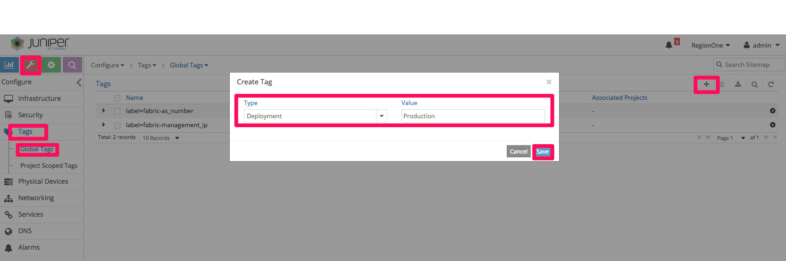
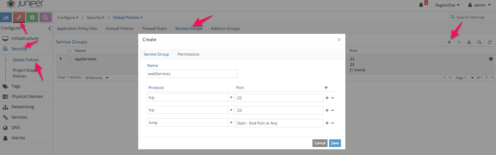
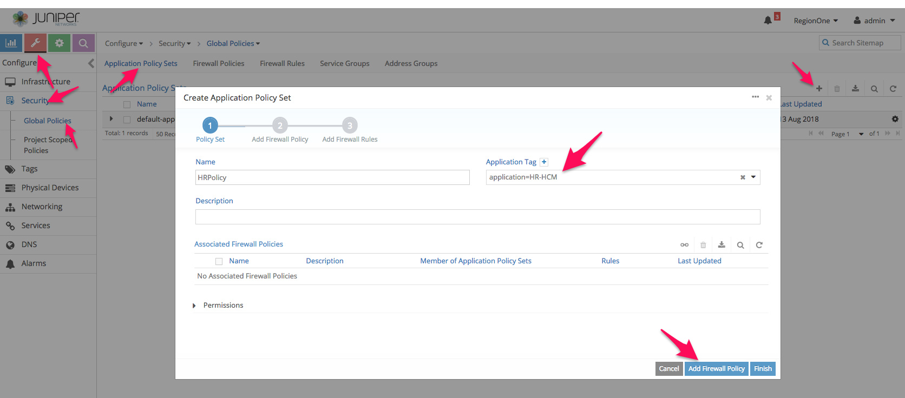
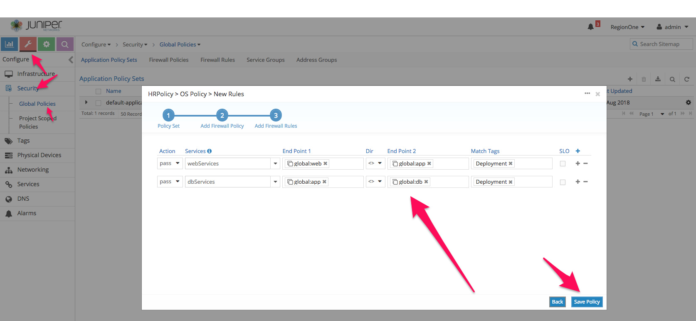
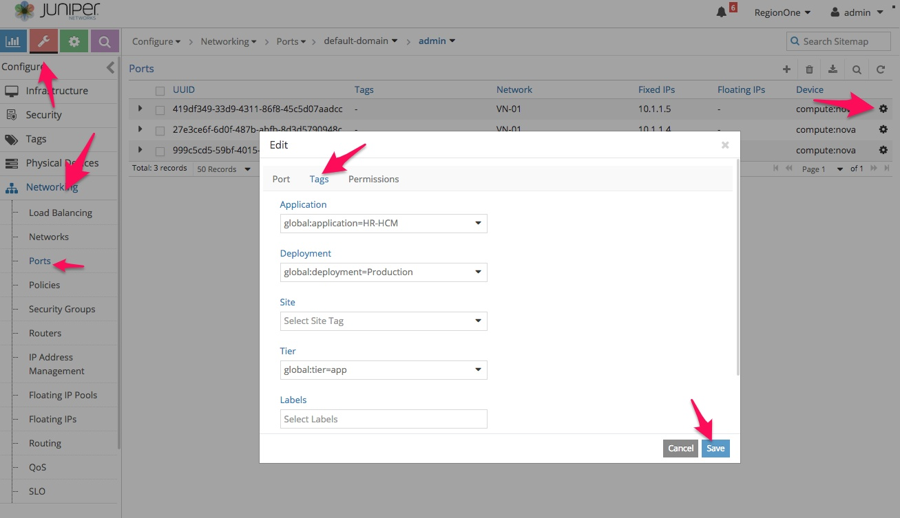

**Prerequisites**: A host machine with Ubuntu/CentOS OS preinstalled with Vagrant & VirtualBox SW.

For Vagrant and VirtualBox setup [vagrant-host-setup/README.md](https://gitlab.com/sohaibazed/contrail-all-in-one/tree/master/vagrant-host-setup)

### Download Repo from Gitlab
```bash
host> git clone https://gitlab.com/sohaibazed/contrail-controller-bgp-peering.git 
host> cd contrail-controller-bgp-peering 
```

### Update Docker repository password in instances.yml file.
Place contrail-ansible-deployer-5.0.2-0.360.tgz in project directory and updated hub.juniper.net docker repository passwords in instances.yaml files. 
```bash
host> vi scripts/instances1.yml
host> vi scripts/instances2.yml
```

### Run vagrant deployer.
```bash
host> vagrant status
host> vagrantup
```

### How to use Foxy Proxy for GUI access

Follow these steps for GUI access via FoxyProxy.
1- Open FireFox and open https://addons.mozilla.org/en-US/firefox/ URL.
2- Search for FoxyProxy and select "FoxyProxy Standard"
3- Click on "Add to Firefox"


Now open ssh port forwading session to physical server using port 1080. please change IP as per your host config

```bash
your-laptop> ssh root@<< physical server ip>> -D 1080
```

Configure FireFox FoxyProxy add-on by configuring "127.0.0.1" & port 1080 as Scoks4 as captured in screenshot.


Now enable FoxyProxy add-on by selecting the profile created earlier and open Contrail GUI using IP address of Vagrant VM https://192.168.100.21:8143


## Access Contrail and Openstack UIs

| Deployement # | Service   | URL                         | Username | Password    |
| ------------- | --------- | --------------------------- | -------- | ----------- |
| 1 | openstack | http://192.168.100.21       | admin    | contrail123 |
| 1 | contrail  | https://192.168.100.21:8143 | admin    | contrail123 |
| 2 | openstack | http://192.168.100.22       | admin    | contrail123 |
| 2 | contrail  | https://192.168.100.22:8143 | admin    | contrail123 |

## Create workloads

for this examples use basic-sanity-test-controller-<<1 or 2>>.sh scripts to create workloads. the scripts will 
1. Install Openstack Python libraries
2. Download and create Cirros images in Glance
3. Create Openstack flavors.
4. Create Openstack Virtual network "VN01"
5. Create three VMs using Virtual Netowkr VN01

```bash
host> vagrant ssh srv1
srv1> sh /vagrant/scripts/basic-sanity-test-controller-1.sh
srv1> exit

host> vagrant ssh srv2
srv2> sh /vagrant/scripts/basic-sanity-test-controller-2.sh
srv2> exit
```

## Configuring BGP
### Add BGP router
1. Log into Contrail UI for controller1  https://192.168.100.21:8143
2. Go to Configure> BGP Routers > + 
3. Add controller2 as a BGP router in controller 1 
4. Repeat step 1,2 and 3 on controller 2


### Add Route targets in VN01 Virtual Network
1. Go to Configure> Netowkring> Networks and edit "VN01"
2. Add a Route Target to this virtual network. 
3. Use the same route target in Controller2 VN01

## Configure Tag-based Contrail Security
### Create Tags

1. Go to Configure> Tags> Global tags> +
2. Create the following tags
  * Application: HR-HCM
  * Deployment: Development, Production
  * Tier= web, app, db



### Writing Policies

1. Create service group to allow tcp, udp and icmp traffic for each tier.



2. Go to Configure> Security> Global Policies> +
3. Create Application Policy Set (APS) and select application tag as "HR-HCM"



4. Associate firewall policy and the following rules
  * web > app
  * app > db



### Associate tags to contrail objects
For the policies to take effect, last step is to associate tags to contrail objects. These can be attached at the project, virtual network or virtual machine interface (VMI) level. The hierarchy is such that more granular takes precedence.

1. Go to Configure> Netoworking> Ports 
2. Assign Application, Site and Deployment tags to each VM port



| Deployment # | VM Name | IP Address | Tags |
| ------------ | ------- | ---------- | ---- |
| 1 | vm01vn01controller01 | 10.1.1.3   | app |
| 1 | vm02vn01controller01 | 10.1.1.4   | db  |
| 1 | vm03vn01controller01 | 10.1.1.5   | app |
| 2 | vm01vn01controller02 | 10.1.1.100 | db  |
| 2 | vm02vn01controller02 | 10.1.1.101 | web |
| 2 | vm03vn01controller02 | 10.1.1.102 | web |

### Testing
1. Go to Monitor> Control Nodes> <<controller name>> Routes> 
2. Select a route advertised by the other controller. 
3. You will see each route carries tag information 

